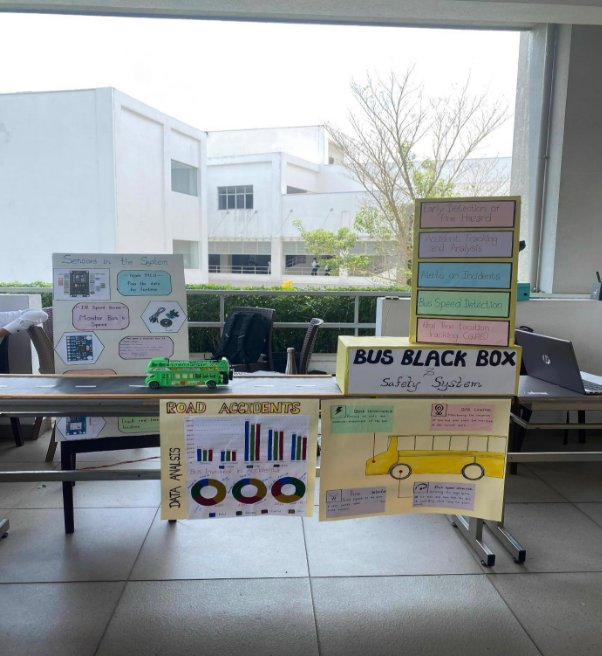

` `![ref1]

1|Page ![ref2]

Faculty of Computing ![ref1]

BSc Software Engineering (University of Plymouth)

2023-2024 

Plymouth Batch 11  

PUSL2022 – Introduction to IOT (23/AY/AU/M)

Module leader- Mr. Isuru Sri Bandara /Mr. Chamindra Attanayake 

Bus Black Box System 

Final Report Group DP 

**Senadhipathirage Vimantha– 10898689 Kariyawasam Dulmin – 10898451     Beragama Kalpani– 10899573** 

**Sanuki Wedage – 10898696       Achira Jayawickrama – 10898509** 

2|Page ![ref2]

Table of Contents ![ref1]

[Chapter 1 – Introduction ........................................................................................... 7 ](#_page6_x69.00_y72.92)[Overview .............................................................................................................. 8 ](#_page7_x69.00_y72.92)

[Advantages of The System ........................................................................................ 9 ](#_page8_x69.00_y72.92)[Chapter 2 – Literature Review .................................................................................. 10 ](#_page9_x69.00_y72.92)

[Background Research ......................................................................................... 10 ](#_page9_x69.00_y104.92)[Chapter 3 – Methodology ........................................................................................ 12 ](#_page11_x69.00_y72.92)

[Project Design .................................................................................................... 12 ](#_page11_x69.00_y128.92)[Flow Chart ...................................................................................................... 13 ](#_page12_x69.00_y72.92)[Block Diagram ................................................................................................ 14 ](#_page13_x69.00_y96.92)

[Microcontroller in the Bus Black Box System ........................................................ 15 ](#_page14_x69.00_y72.92)[Sensors in the Bus Black Box System ................................................................... 15 ](#_page14_x69.00_y322.92)[Components and Modules used in the System .................................................. 16 ](#_page15_x69.00_y72.92)[System Architecture Diagram ........................................................................... 18 ](#_page17_x69.00_y346.92)[Entity Relationship Diagram ............................................................................. 19 ](#_page18_x69.00_y97.92)[Use Case Diagram........................................................................................... 20 ](#_page19_x69.00_y72.92)

[Chapter 4 - Results and Discussion ......................................................................... 21 ](#_page20_x69.00_y72.92)

[Bus Black Box System Sketch Schema ................................................................. 21 ](#_page20_x69.00_y129.92)[Circuit Diagram .................................................................................................. 22 ](#_page21_x69.00_y97.92)[Code Evidence ................................................................................................... 28 ](#_page27_x69.00_y72.92)[Prototype - Bus Black Box System ........................................................................ 37 ](#_page36_x69.00_y72.92)[System Testing ................................................................................................... 38 ](#_page37_x69.00_y72.92)[Project Planning – Gantt/Timeline ........................................................................ 39 ](#_page38_x69.00_y72.92)[Work Breakdown ................................................................................................ 40 ](#_page39_x69.00_y72.92)[Budget Plan ........................................................................................................ 41 ](#_page40_x69.00_y72.92)[Risk Management Plan ........................................................................................ 42 ](#_page41_x69.00_y72.92)[Work Matrix ........................................................................................................ 43 ](#_page42_x69.00_y72.92)

[Chapter 5 - Conclusion and Future Work ................................................................. 45 ](#_page44_x69.00_y72.92)

[Conclusion ..................................................................................................... 45 ](#_page44_x69.00_y129.92)[Future Work ....................................................................................................... 46 ](#_page45_x69.00_y72.92)

3|Page ![ref2]

[Commercial Value of the System...................................................................... 46 ](#_page45_x69.00_y98.92)![ref1][Appendix ........................................................................................................... 47 ](#_page46_x69.00_y72.92)

[References ............................................................................................................ 48 ](#_page47_x69.00_y72.92)

List of Figures 

[Figure 1 - Bus Black Box Exhibition presentation ......................................................... 8 ](#_page7_x149.00_y748.92)[Figure 2 - Road Accidents Analysis .......................................................................... 10 ](#_page9_x297.00_y615.92)[Figure 3 - Bus Black Box  Implementation................................................................. 12 ](#_page11_x179.00_y743.92)[Figure 4 - Flow Chart .............................................................................................. 13 ](#_page12_x90.00_y702.92)[Figure 5 - Block Diagram ......................................................................................... 14 ](#_page13_x69.00_y412.92)[Figure 6 - System Architecture Diagram ................................................................... 18 ](#_page17_x39.00_y679.92)[Figure 7 - Entity Relationship Diagram...................................................................... 19 ](#_page18_x69.00_y392.92)[Figure 8 - Use Case Diagram ................................................................................... 20 ](#_page19_x104.00_y532.92)[Figure 9 - Sketch Schema ....................................................................................... 21 ](#_page20_x28.00_y539.92)[Figure 10 - Circuit Diagram ...................................................................................... 22 ](#_page21_x63.00_y464.92)[Figure 11 - Test Cases ............................................................................................. 38 ](#_page37_x23.00_y686.92)[Figure 12 -Work Breakdown .................................................................................... 40 ](#_page39_x69.00_y448.92)

List of Tables 

[Table 1 - Timeline ................................................................................................... 39 ](#_page38_x69.00_y685.92)[Table 2 - Budget Plan .............................................................................................. 41 ](#_page40_x69.00_y522.92)[Table 3 - Risk Mitigation .......................................................................................... 42 ](#_page41_x69.00_y531.92)[Table 4 - Report Contribution .................................................................................. 44 ](#_page43_x69.00_y263.92)[Table 5 - Project Contribution .................................................................................. 44 ](#_page43_x69.00_y704.92)

4|Page ![ref2]

Acknowledgment ![ref1]

I would like to express our gratitude to Mr. Isuru Sri Bandara and Mr. Chamindra Attanayake. Our module leaders for their invaluable guidance and support throughout the development of the Bus Black Box System Project. 

We would like to extend our heartfelt gratitude to the group members for their dedication, commitment, and hard work to the success of the project. Each team member’s collaboration have been essential in overcoming challenges and achieving our goal.  

Finally. We express our gratitude to our loved ones and companinons for being understanding, motivating, and standing by our side throughout this project. Grateful to all those who have been a part of this journey.  

5|Page ![ref2]

Abstract ![ref1]

The Bus Black Box IoT device is an advanced solution that aims to enhance safety and effectiveness in the public transportation industry. Making use of Internet of Things (IoT) technology, this device implements multiple sensors to oversee the operation of the Location, Speed, Temperature, and Acceleration. The foremost goal of this black box system is helps to monitor daily operations while simultaneously identifying possible safety hazards and accidents in advance through analytics based on the collected 

dataset at hand.  

Collect all real-time data securely on Firebase allowing operations to follow the performance metrics while detecting incidents promptly with its timely notification functionality embedded within it, in this Bus Black Box System empowers for the transportation authorities to take proactive actions to prevent accidents and improve passenger safety.By leaveraging IoT technology, the Bus Black Box offers cost-effective solution for improving bus transportation safety and management.

6|Page ![ref2]

Chapter 1 – Introduction ![ref1]

The concept of the BUS BLACK BOX SYSTEM is used for the safety and tracking of the bus operation. Nowadays we would like to have a robust system that covers various aspects of bus operations and safety including real-time-tracking and route 

optimization, additionally monitoring vehicle speed, ensuring that the bus operates 

within safe limits. For improvement enhance safety by detecting fire hazards early on. If there is a system like that fulfilling the above circumstances, it is a piece of good news. So, we have come up with a solution an embedded system technology methods may 

use GPS tracking and sensors and relevant data analyzing systems to this existing Bus Black Box.  

The protection of passengers and vehicles is crucial in today's advanced transportation industry. To accomplish this, the IoT Bus Black Box system offers an innovative approach that enhances real-time monitoring, tracking, and analysis of bus operations. Looking at the exact location of the bus. This tracking system monitors and analyses the exact time of the destinated arrival time and understands the technologies integrated into this bus black box system. Through integration with Internet of Things (IoT) technology, a variety of sensors and modules gather extensive data about 

environmental conditions, critical incidents, or events happening on board for delivering better service to everyone involved. The IoT bus black box is essentially a sophisticated system comprised of a complex network consisting of communication devices, 

sensors, and microcontrollers installed internally within the bus. By operating smoothly with one another; these components collect essential data on key aspects concerning the operation of the vehicle such as its location, temperature acceleration speed amongst other critical areas. 

Leveraging top-tier tech like NodeMCU microcontrollers or IR speed sensors alongside MPU6050 accelerometers & NEO-6M GPS modules empowers this cutting-edge platform's ability for real-time monitoring analysis ushering us into a smarter age when it comes to tracking public transit activities. The IoT bus black box system provides more than just incident detection as it offers multiple functionalities that improve the overall safety, efficiency, and performance of buses. The system monitors driver behavior, and vehicle maintenance and optimizes route planning for effective passenger management with invaluable insights that benefit transportation authorities and operators alike.

The IoT bus black box system is a remarkable breakthrough in bus monitoring and management technology, which can be concluded. The use of IoT capabilities to gather, evaluate, and act on present data makes the system effective for transportation stakeholders who aim at improving safety measures as well as efficiency and dependability standards across their fleets. In this case, Exploring this system helps to determine circumstances such as the cause of road accidents, road accidents, malfunction, or failures and evaluate the diver's actions

7|Page ![ref2]

Overview  

In today's world of transportation, ensuring the safety and efficiency of bus 

operations is vital. The Black Box for Buses project is a cutting-edge technology that  will change how buses are monitored and controlled. This breakthrough system integrates advanced sensor technologies to give real-time tracking and comprehensive safety features, resulting in a powerful platform for fleet 

management.  

The purpose of this concept is to enhance the safety of passengers, track vehicle movements, monitor driver behaviors, and assist accidents proactively with indications, malfunctions, or failures in the bus. The Bus Black Box System provides multiple pieces of information such as vehicle speed, GPS locations, identifying potential fire hazards, and contributing to passenger safety. This bus black box system is essentially an onboard device that tracks and monitors all the data records of the bus performance and activities. The primary contribution of this system is to track the bus performance and real-time tracking system. This allows for accurate progress, and a plan of the exact route of the bus, and in terms of passenger safety, the black box system provides various parameters related to the bus system 

including vehicle speed, bus route, and driver's behaviour. In case of an accident or incident occurrence, the Black Box System can identify proactively then provide valuable insights into the cause and help to determine. Overall, a bus management system offers a comprehensive solution for bus tracking, performance monitoring, and safety enhancement. It helps to optimize and monitor bus operations, and 

passenger safety and provides valuable data for evaluating improvements.

*Figure 1 - Bus Black Box Exhibition presentation* 

8|Page ![ref2]

Advantages of The System  ![ref1]

- Accident investigation - Insights leading up to considering investigation throughout the incident. 
- Real-Time Monitoring – Monitoring various parameters such as speed, location, and vehicle dynamics. 
- Driver Behavior Analysis – The system enables operators to assess and address unsafe driving practices.  
- Enhances Passenger Safety – Enhancing passenger safety and confidence in public transportation. 
- Operational Efficiency – Leading to improve operational efficiency. 

9|Page ![ref2]

Chapter 2 – Literature Review   

Background Research  

In today’s era of modernized and advanced technology, IOT has emerged as a revolutionary force in today’s rapidly growing technology, transforming several businesses and sectors. The concept of a “BLACK BOX” system was first used by 

aircraft to record conversations and flying data has become popular in various forms of transportation, such as buses. An onboard device called a “BUS BLACK BOX SYSTEM” monitors and records several factors relevant to the bus operation of the bus, and the surrounding environment. “BLACK BOX” collects data from the sensors mounted on the bus and offers important insights into cases of problems, accidents, and inefficient operations.  

Aligned with this approach to change, we introduced the BUS BLACK BOX SYSTEM, an innovative Internet of Things initiative designed to improve the efficiency and safety of the bus operation system.  The bus operation relies only on bus time tracking but here we are often used to monitoring the bus in real-time location and route tracking, and important factors including monitoring  bus speed, drivers’ behavior such as  acceleration and braking, and bus  operations such as detection of some of  the fire hazards, and incident reporting.  For bus operators, this oversight gap  presents serious obstacles to maintaining  passenger safety, route management, and  efficiency in handling emergencies and  accidents.  

The “BUS BLACK BOX SYSTEM” is a  revolutionary approach that uses Internet  of Things technology to completely  change bus transportation operations.  The technology has the potential to bring  

*Figure 2 - Road Accidents Analysis* in a new age of safety, efficiency, and 

dependability in bus operations by offering real-time monitoring, proactive safety measures, and data-driven insights.  

In the above image displays the Road Accidents caused due to buses. The incorporation of a black box system in buses can aid the reduction of accidents by facilitating driver observation and behavior analysis, reconstruction and determination of incidents' underlying causes, instantaneous notifications/alerts, optimization of routes/traffic management as well as pre-emptive maintenance & health monitoring.  

10|Page ![ref2]

By utilizing the perspectives and functionalities afforded by black box systems in ![ref1]transport operations, governing agencies can establish more secure bus networks that are not only efficient but also reduce road mishaps significantly on highways.

11|Page ![ref2]

Chapter 3 – Methodology 

Project Design  

The system design of the project is focused on designing and setting up an IoT device that is popularly referred to as a “Bus Black Box”. Installed inside buses, this device acts as a complete monitoring and data-collecting system to improve public transportation efficiency and safety. To collect and process relevant data, an IoT device is made up of 

a number of carefully positioned sensors and modules inside the bus. Important parts include temperature sensors that monitor the inside bus temperature, a GPS module to track location, an accelerometer to detect accelerations, and a speed sensor to track vehicle velocity.  

To securely communicate the data, collect across wireless communication protocols like cellular networks and Wi-Fi. A dependable and energy-efficient microcontroller unit (MCU) powers the device, ensuring continuous functioning without draining the power supply.   

During the development stage, the IoT device goes through comprehensive testing and validation processes and ensures robustness and reliability. To verify overall performance and functionality, this involves system testing, hardware component integration testing, and functional testing of individual sensors. All things considered, this project intends to improve public transportation and maximize operational efficiency in bus operations.  

*Figure 3 - Bus Black Box  Implementation* 

12|Page ![ref2]

Flow Chart ![ref1]

*Figure 4 - Flow Chart* 

13|Page ![ref2]

Block Diagram ![ref1]

*Figure 5 - Block Diagram* 

14|Page ![ref2]

Microcontroller in the Bus Black Box System  

NodeMCU  

Sensors in the Bus Black Box System  

MPU60 

NEO 6M GPS Module 

IR Speed sensor with encoder wheel  

15|Page ![ref2]

Components and Modules used in the System  

NodeMCU ESP8266 Microcontroller  

The Bus Black Box IoT device relies heavily on the NodeMCU module, which serves as both the data management and communication hub for the system. The NodeMCU ESP8266 microcontroller, along with its integrated Wi-Fi connectivity, makes it an ideal platform to collect sensor data from various devices in buses. Through input/output 

pins and efficient interfaces with sensors like IR speed sensor, GPS module, or MPU6050 sensor; crucial information such as bus speed, location temperature & accelerometer readings can be acquired  effortlessly.   

Leveraging its real-time data transmission  capabilities, the NodeMCU seamlessly  communicates with remote servers,  

facilitating the transmission of sensor data to  the Firebase database. NodeMCU is playing a  vital role in Bus Black Box IoT devices, making  it indispensable in modern vehicle monitoring  and tracking solutions.   

MPU6050 

MPU6050 is a multipurpose sensor that integrates a temperature and the accelerometer onto a single chip. This offers accurate three-axis acceleration and rotation rate readings. 

The MPU6050 is mostly used in the Bus Black Box system to  track the bus’s motion and identify sudden changes or  impacts that could point to collisions. In addition to that this  module is used to track the temperature of the bus. When  potentially in dangerous situations like sudden fire breakouts,  identify and notify authorities immediately.   

T = (int)Temperature / 340 + 36.53;   // Temperature formula 

This sensor has monitored the directions and angle of the bus, which is used to get a complete understanding of vehicle dynamics.

16|Page ![ref2]

IR Speed Sensor with encoder wheel  

The IR speed sensor is responsible for measuring the bus’s speed by detecting the rotation of its encoder wheels. It detects accurate speed calculations with the equation of the speed, 

`   `double circumference = 3.14159265358979323846 \* 25;  // Circumference in mm    double revolutions = pulseCount / 20.0;

`   `double distance = revolutions \* circumference / 1000000;  // Distance in km 

`    `speed = distance / (5.0 / 3600);       // Speed in km/h 

` `The speed sensor gives the system real-time velocity data, which allows it to track the speed of the vehicle and detect incidents of unpredictable, and drivers’ behaviors.  

This Bus Black Box system’s IR speed sensor with encoder wheels with 20 holes that are evenly placed and positioned to work with an IR sensor. 

 

17|Page ![ref2]

NEO 6M GPS Module  ![ref1]

GPS module provides accurate positioning and navigation data for the bus. This module offers location tracking and incident Mapping. With the geographical location allowing route optimization, GPS coordinates are logged for incidents or accidents and for  insurance claims processing.

System Architecture Diagram  

*Figure 6 - System Architecture Diagram* 

18|Page ![ref2]

Entity Relationship Diagram  ![ref1]

*Figure 7 - Entity Relationship Diagram* 

19|Page ![ref2]

Use Case Diagram  ![ref1]

*Figure 8 - Use Case Diagram* 

20|Page ![ref2]

Chapter 4 - Results and Discussion  

Bus Black Box System Sketch Schema  

*Figure 9 - Sketch Schema* 

21|Page ![ref2]

Circuit Diagram  

IR Speed Sensor  MPU6050 

NodeMCU 

GPS 

Speaker 

*Figure 10 - Circuit Diagram* 

IoT devices Several sensor modules and components are utilized to create a bus black box system. Significant details are as follows; 

The NodeMCU (ESP8266) functions as the primary microcontroller component, managing communication with diverse sensor modules and sending data to the Firebase database through Wi-Fi. 

#define WIFI\_SSID "Raminda\_rulzz\_" #define WIFI\_PASSWORD "Raminda@123"

#define FIREBASE\_HOST "nodemcu5575-default-rtdb.asia southeast1.firebasedatabase.app"

#define FIREBASE\_AUTH"HWrrY1F1QjJrkKZkwgQgXaCia56yK6JefnoJ6r0F" 

22|Page ![ref2]

NodeMCU establishes a connection to the specified Wi-Fi network using the provided ![ref1]SSID and Password. 

WiFi.begin(WIFI\_SSID, WIFI\_PASSWORD); WiFi.begin(WIFI\_SSID, WIFI\_PASSWORD); Serial.print("Connecting to Wi-Fi"); 

Firebase  

Firebase Integration is achieved through the use of the Firebase Arduino library. The collected data from sensor modules is transformed into JSON objects and saved in the Firebase Realtime Database for future reference. Furthermore, push notifications are sent out during catastrophic events such as accidents or detected fires to alert authorities instantly on potential dangers within the vicinity.

Data collected from sensors (GPS, MPU6050, and IR Speed sensor) is structured into JSON format and pushed to the Firebase.

Firebase inizialitation  

Firebase host URL and authentication key provided. Firebase.begin(FIREBASE\_HOST, FIREBASE\_AUTH);

Push data into Firebase  

// GPS  

Firebase.setFloat("/blackbox\_values/lat", Latitude); Firebase.setFloat("/blackbox\_values/lng", Longitude);

// Temperature  Firebase.setInt("/blackbox\_values/bus\_temperature", T); // Acceleration Spike  Firebase.setBool("/blackbox\_values/acceleration\_spike", 

accelerationSpike); 

message = "ACCIDENT DETECTED !!"; 

23|Page ![ref2]

// Speed  ![ref1]

Firebase.setFloat("/blackbox\_values/speed", speed); // Notification Messages  Firebase.setString("/notification/message", message); Firebase.setBool("/notification/istrue", true);

GPS Module  

The GPS module (NEO-6M) utilizes SoftwareSerial and delivers up-to-date latitude and longitude coordinates of the bus. These details are saved in the Firebase database at regular intervals, enabling accurate tracking of its location.

GPS module initialized using Libraries.  #include <TinyGPS++.h> #include <SoftwareSerial.h> 

With pin 4 as the TXD and pin 5 as the RXD pin. This allows the NodeMCU to communicate with the GPS module via software serial. 

TinyGPSPlus gps;

SoftwareSerial SerialGPS(4, 5); 

Data from the GPS module is continuously read and processed. while (SerialGPS.available() > 0) 

if (gps.encode(SerialGPS.read())) { 

// check if GPS location data is valid   if (gps.location.isValid()) { 

Latitude = gps.location.lat(); 

Longitude = gps.location.lng(); 

24|Page ![ref2]

// Print latitude and longitude to serial moniotr ![ref1]

Serial.print("Latitude : " ) Serial.println(Latitude); 

Serial.print("Longitude : "); Serial.println(Longitude); 

// Store latitude and longitude in Firebase Database 

Firebase.setFloat("/blackbox\_values/lat", Latitude); Firebase.setFloat("/blackbox\_values/lng", Longitude); 

} 

} IR Speed Sensor  

The IR speed sensor calculates the bus's velocity and is linked to a digital pin (D8) using interruptions to tally pulses from the device. By counting how many impulses it gets during a fixed period, this data generates rates that are saved into the Firebase database too. 

The sensor pin is defined as d8 which represents D8 on the NodeMCU. const int sensorPin = D8;   // Speed sensor pin 

The speed of the bus is calculated based on the number of pulses received from the IR Speed sensor. The pulse count variable is increased each time the sensor detects holes in the encoder wheel, representing the revolution. 

double circumference = 3.14159265358979323846 \* 25;   

// Circumference in mm

double revolutions = pulseCount / 20.0;

double distance = revolutions \* circumference / 1000000;   // Distance in km

25|Page ![ref2]

speed = distance / (5.0 / 3600);                           ![ref1]// Speed in km/h 

MPU6050 Module 

The MPU6050 is utilized to measure temperature along with accelerometer data. An Accelerometer and Temperature Sensor use the I2C protocol to transmit data. It detects acceleration spikes that may indicate potential accidents while providing temperature readings for monitoring the bus's temperature. The Firebase database records both accelerometer and temperature data.

const uint8\_t scl = D6, sda = D7;  // MPU6050 I2C pins Wire library communicates between SCL and SDA pins.

Wire.begin(sda, scl);

Temperature Calculation  

The sensor is converted to Celsius using the formula provided in the code. Temperature detection is monitoring when happen a sudden fire breaks out. 

T = (int)Temperature / 340 + 36.53;  // Temperature formula Acceleration  

The raw accelerometer values obtained from the MPU6050 sensor are converted to actual acceleration values using the provided sensitivity scale factor and formula. Acceleration values represent the acceleration experiences along each axis in unit g (gravity). 

// Read accelerometer values continuously 

Read\_RawValue (MPU6050SlaveAddress,MPU6050\_REGISTER\_ACCEL\_XOUT\_H); 

double Ax = (double)AccelX / AccelScaleFactor; double Ay = (double)AccelY / AccelScaleFactor; double Az = (double)AccelZ / AccelScaleFactor; 

Acceleration Spike Detection  

26|Page ![ref2]

The current acceleration readings and actual acceleration values(Ax, Ay, Az). The ![ref1]difference between the current and previous acceleration values is calculated. In this case, the predefined threshold value is 1.5.

// Detect acceleration spikes continuously

bool currentAccelerationSpike = abs(Ax - lastAx) > 1.5 || abs(Ay - lastAy) > 1.5 || abs(Az - lastAz) > 1.5; 

Upon detecting an acceleration spike, activating a buzzer, or sending a notification to alert users about potential accidents.

if (currentMillis - spikeTimestamp <= spikeDuration) { accelerationSpike = true; 

else { 

accelerationSpike = currentAccelerationSpike; 

In summary, the implementation of this IoT device integrates multiple sensor modules with a NodeMCU microcontroller to establish an all-encompassing bus black box system that can actively track crucial metrics such as position, velocity, momentum, and temperature. The information gathered is then saved in a Firebase database for additional evaluation and reporting purposes.

27|Page ![ref2]

Code Evidence  

#include <ArduinoJson.h> #include <TinyGPS++.h> #include <SoftwareSerial.h> #include <ESP8266WiFi.h> #include <NTPClient.h> #include <WiFiUdp.h> #include <FirebaseArduino.h> #include <Wire.h> 

#define WIFI\_SSID "Raminda\_rulzz\_" 

#define WIFI\_PASSWORD "Raminda@123" 

#define FIREBASE\_HOST "nodemcu5575-default-rtdb.asia- southeast1.firebasedatabase.app" 

#define FIREBASE\_AUTH "HWrrY1F1QjJrkKZkwgQgXaCia56yK6JefnoJ6r0F" 

TinyGPSPlus gps; SoftwareSerial SerialGPS(4, 5); 

WiFiUDP ntpUDP; 

NTPClient timeClient(ntpUDP, "pool.ntp.org"); 

String epochTime; 

String tt, message; 

float Latitude, Longitude; 

double speed; 

unsigned long lastTime = 0; 

unsigned long timerDelay = 60000; 

int sta; 

const int sensorPin = D8;          // Speed sensor pin const uint8\_t scl = D6, sda = D7;  // MPU6050 I2C pins const uint8\_t buzzerPin = D3;      // Buzzer pin for acceleration spike 

unsigned long previousMillis = 0; 

const long interval = 5000;  // 5-second interval for speed calculation 

volatile int pulseCount = 0; 

bool accelerationSpike = false; 

28|Page ![ref2]

int T; 

// MPU6050 Slave Device Address 

const uint8\_t MPU6050SlaveAddress = 0x68; 

// MPU6050 configurations 

const uint8\_t MPU6050\_REGISTER\_SMPLRT\_DIV = 0x19; 

const uint8\_t MPU6050\_REGISTER\_USER\_CTRL = 0x6A; 

const uint8\_t MPU6050\_REGISTER\_PWR\_MGMT\_1 = 0x6B; 

const uint8\_t MPU6050\_REGISTER\_PWR\_MGMT\_2 = 0x6C; 

const uint8\_t MPU6050\_REGISTER\_CONFIG = 0x1A; 

const uint8\_t MPU6050\_REGISTER\_GYRO\_CONFIG = 0x1B; const uint8\_t MPU6050\_REGISTER\_ACCEL\_CONFIG = 0x1C; const uint8\_t MPU6050\_REGISTER\_FIFO\_EN = 0x23; 

const uint8\_t MPU6050\_REGISTER\_INT\_ENABLE = 0x38; 

const uint8\_t MPU6050\_REGISTER\_ACCEL\_XOUT\_H = 0x3B; const uint8\_t MPU6050\_REGISTER\_SIGNAL\_PATH\_RESET = 0x68; 

// sensitivity scale factor respective to full scale setting provided in datasheet 

const uint16\_t AccelScaleFactor = 16384; 

const uint16\_t GyroScaleFactor = 131; 

double lastAx = 0, lastAy = 0, lastAz = 0; 

int16\_t AccelX, AccelY, AccelZ, Temperature, GyroX, GyroY, GyroZ; 

unsigned long spikeTimestamp = 0; 

const long spikeDuration = 5000;  // Duration to keep the spike status as true in milliseconds 

void IRAM\_ATTR sensorInterrupt() {   pulseCount++; 

} 

void setup() { 

`  `Serial.begin(9600); 

`  `// SerialGPS.begin(9600); 

`  `pinMode(sensorPin, INPUT\_PULLUP); 

29|Page ![ref2]

`  `pinMode(buzzerPin, OUTPUT); 

`  `attachInterrupt(digitalPinToInterrupt(sensorPin), sensorInterrupt, FALLING); 

`  `Wire.begin(sda, scl); 

`  `MPU6050\_Init(); 

`  `WiFi.begin(WIFI\_SSID, WIFI\_PASSWORD); 

`  `Serial.print("Connecting to Wi-Fi"); 

`  `while (WiFi.status() != WL\_CONNECTED) { 

`    `Serial.print("."); 

`    `delay(300); 

`  `} 

`  `Serial.println(); 

`  `Serial.print("Connected with IP: "); 

`  `Serial.println(WiFi.localIP()); 

`  `Serial.println(); 

`  `timeClient.begin(); 

`  `timeClient.setTimeOffset(0); 

`  `timeClient.update(); 

`  `epochTime = timeClient.getEpochTime(); 

`  `Serial.println(epochTime); 

`  `Firebase.begin(FIREBASE\_HOST, FIREBASE\_AUTH); 

} 

void loop() { 

`  `epochTime = timeClient.getEpochTime();   tt = epochTime + "000"; 

`  `if ((millis() - lastTime) > timerDelay) {       // One min time delay 

`    `pushData(); 

`    `lastTime = millis(); 

`  `} 

`  `///////////////////////////////////////////////////////////// 

`  `while (SerialGPS.available() > 0) 

`    `if (gps.encode(SerialGPS.read())) {       if (gps.location.isValid()) { 

30|Page ![ref2]

`        `Latitude = gps.location.lat(); 

`        `Serial.print("Latitude : "); 

`        `Serial.println(Latitude); 

`        `Longitude = gps.location.lng(); 

`        `Serial.print("Longitude : "); 

`        `Serial.println(Longitude); 

`        `Firebase.setFloat("/blackbox\_values/lat", Latitude);         Firebase.setFloat("/blackbox\_values/lng", Longitude);       } 

`    `} 

`  `Firebase.setFloat("/blackbox\_values/lat", Latitude);   Firebase.setFloat("/blackbox\_values/lng", Longitude); 

`  `unsigned long currentMillis = millis(); 

`  `// Read accelerometer and temperature values continuously   Read\_RawValue(MPU6050SlaveAddress, MPU6050\_REGISTER\_ACCEL\_XOUT\_H); 

`  `double Ax = (double)AccelX / AccelScaleFactor; 

`  `double Ay = (double)AccelY / AccelScaleFactor; 

`  `double Az = (double)AccelZ / AccelScaleFactor; 

`  `T = (int)Temperature / 340 + 36.53;  // Temperature formula   Serial.print("T : "); 

`  `Serial.println(T); 

`  `Firebase.setInt("/blackbox\_values/bus\_temperature", T); 

`  `if (T > 50 && sta == 0) { 

`    `sta = 1; 

`    `message = "FIRE DETECTED!!";     notfy(); 

`  `} else if (T < 50 && sta == 1) {     sta = 0; 

`  `} 

`  `if (T > 50 && sta == 0) { 

`    `sta = 1; 

`    `pushData(); 

`  `} else if (T < 50 && sta == 1) {     sta = 0; 

31|Page ![ref2]

`  `} 

`  `// Detect acceleration spikes continuously 

`  `bool currentAccelerationSpike = abs(Ax - lastAx) > 1.5 || abs(Ay - lastAy) > 1.5 || abs(Az - lastAz) > 1.5; 

`  `if (currentAccelerationSpike) { 

`    `spikeTimestamp = currentMillis;  // Update the timestamp of the last spike 

`    `digitalWrite(buzzerPin, HIGH); 

`    `delay(1000);  // Adjust duration as needed 

`    `digitalWrite(buzzerPin, LOW); 

`  `} 

`  `if (currentMillis - spikeTimestamp <= spikeDuration) { 

`    `accelerationSpike = true; 

`    `Firebase.setBool("/blackbox\_values/acceleration\_spike", accelerationSpike); 

`    `message = "ACCIDENT DETECTED !!"; 

`    `notfy(); 

`    `if (accelerationSpike == true &&sta == 0) { 

`      `sta = 1; 

`      `pushData(); 

`    `} else if (accelerationSpike == false &&sta == 1) { 

`      `sta = 0; 

`    `} 

`  `} else { 

`    `accelerationSpike = currentAccelerationSpike; 

`    `Firebase.setBool("/blackbox\_values/acceleration\_spike", accelerationSpike); 

`  `} 

`  `// Update the last accelerometer readings   lastAx = Ax; 

`  `lastAy = Ay; 

`  `lastAz = Az; 

`  `// Perform speed calculation at the specified interval   if (currentMillis - previousMillis >= interval) { 

`    `previousMillis = currentMillis; 

`    `detachInterrupt(sensorPin); 

32|Page ![ref2]

`    `double circumference = 3.14159265358979323846 \* 25;  // Circumference in mm 

`    `double revolutions = pulseCount / 20.0; 

`    `double distance = revolutions \* circumference / 1000000;  // Distance in km 

`    `speed = distance / (5.0 / 

3600);                          // Speed in km/h 

`    `if (speed > 2 && sta == 0) { 

`      `sta = 1; 

`      `message = "FIRE DETECTED!!"; 

`      `notfy(); 

`    `} else if (speed < 2 && sta == 1) {       sta = 0; 

`    `} 

`    `if (speed > 2 && sta == 0) { 

`      `sta = 1; 

`      `pushData(); 

`    `} else if (speed < 2 && sta == 1) {       sta = 0; 

`    `} 

`    `Firebase.setFloat("/blackbox\_values/speed", speed);     Serial.print("Speed: "); 

`    `Serial.print(speed); 

`    `Serial.println(" km/h"); 

`    `// Reset pulse count for the next speed calculation     pulseCount = 0; 

`    `attachInterrupt(digitalPinToInterrupt(sensorPin), sensorInterrupt, FALLING); 

`  `} 

`  `// Optionally, you can print the accelerometer and temperature data outside the speed calculation block for continuous monitoring 

`  `Serial.print("Ax: "); 

`  `Serial.print(Ax); 

`  `Serial.print(" Ay: "); 

`  `Serial.print(Ay); 

33|Page ![ref2]

`  `Serial.print(" Az: ");   Serial.print(Az); 

`  `Serial.print(" T: ");   Serial.println(T); 

} 

void MPU6050\_Init() { 

`  `delay(150); 

`  `I2C\_Write(MPU6050SlaveAddress, MPU6050\_REGISTER\_SMPLRT\_DIV, 0x07); 

`  `I2C\_Write(MPU6050SlaveAddress, MPU6050\_REGISTER\_PWR\_MGMT\_1, 0x01); 

`  `I2C\_Write(MPU6050SlaveAddress, MPU6050\_REGISTER\_PWR\_MGMT\_2, 0x00); 

`  `I2C\_Write(MPU6050SlaveAddress, MPU6050\_REGISTER\_CONFIG, 0x00); 

`  `I2C\_Write(MPU6050SlaveAddress, MPU6050\_REGISTER\_GYRO\_CONFIG, 0x00);   // set +/-250 degree/second full scale 

`  `I2C\_Write(MPU6050SlaveAddress, MPU6050\_REGISTER\_ACCEL\_CONFIG, 0x00);  // set +/- 2g full scale 

`  `I2C\_Write(MPU6050SlaveAddress, MPU6050\_REGISTER\_FIFO\_EN, 0x00); 

`  `I2C\_Write(MPU6050SlaveAddress, MPU6050\_REGISTER\_INT\_ENABLE, 0x01); 

`  `I2C\_Write(MPU6050SlaveAddress, MPU6050\_REGISTER\_SIGNAL\_PATH\_RESET, 0x00); 

`  `I2C\_Write(MPU6050SlaveAddress, MPU6050\_REGISTER\_USER\_CTRL, 0x00); 

} 

void I2C\_Write(uint8\_t deviceAddress, uint8\_t regAddress, uint8\_t data) { 

`  `Wire.beginTransmission(deviceAddress); 

`  `Wire.write(regAddress); 

`  `Wire.write(data); 

`  `Wire.endTransmission(); 

} 

// Read all 14 registers 

void Read\_RawValue(uint8\_t deviceAddress, uint8\_t regAddress) { 

34|Page ![ref2]

`  `Wire.beginTransmission(deviceAddress); 

`  `Wire.write(regAddress); 

`  `Wire.endTransmission(); 

`  `Wire.requestFrom(deviceAddress, (uint8\_t)14); 

`  `AccelX = (((int16\_t)Wire.read() << 8) | Wire.read()); 

`  `AccelY = (((int16\_t)Wire.read() << 8) | Wire.read()); 

`  `AccelZ = (((int16\_t)Wire.read() << 8) | Wire.read()); 

`  `Temperature = (((int16\_t)Wire.read() << 8) | Wire.read());   GyroX = (((int16\_t)Wire.read() << 8) | Wire.read()); 

`  `GyroY = (((int16\_t)Wire.read() << 8) | Wire.read()); 

`  `GyroZ = (((int16\_t)Wire.read() << 8) | Wire.read()); 

} 

void pushData() { 

`  `StaticJsonBuffer<200> jsonBuffer2; 

`  `JsonObject& obj2 = jsonBuffer2.createObject(); 

`  `obj2["acceleration\_spike"] = accelerationSpike; 

`  `obj2["bus\_temperature"] = T; 

`  `obj2["busno"] = "PN 2134"; 

`  `obj2["lat"] = 6.819866752601754;  //replace with - Latitude   obj2["lng"] = 80.03957133876045;  //replace with - Longitude   obj2["speed"] = speed; 

`  `obj2["timestamp"] = tt; 

`  `Firebase.set("/history/" + tt + "", obj2); 

} 

void notfy() { 

`  `Firebase.setString("/notification/message", message); 

`  `Firebase.setBool("/notification/istrue", true); 

} 

35|Page ![ref2]

Firebase  ![ref1]

Data was collected from the sensors and pushed to the firebase and Notify the users.  

36|Page ![ref2]

Prototype - Bus Black Box System  

 

37|Page ![ref2]

System Testing  ![ref1]

To ensure the IoT device Satisfies its designated requirement and operates efficiently in its intended surroundings, system testing must be carried out. In addition, seamless module interaction with sensors for efficient operation. Functional testing procedures such as performance testing & usability assessment are carried out alongside reliability tests making sure all elements work together without external connection interface errors (in this case Firebase). Through conducting system testing methods we can guarantee accurate results when monitoring important bus safety measurements which helps prevent traffic accidents from occurring thanks to improved recording features supplied by our IoT devices. 

*Functional Test Cases in the Bus Black Box System*

|**Quality Assurance Test Cases**||||||||
| - | :- | :- | :- | :- | :- | :- | :- |
|Author|Hiruni |Test Case Summary|Pass|Fail|Onhold|Not Executed|Total |
|Date Created |11/11/2023|High|4|0|0|0|4|
|Last Update|10/04/2024|Medium |0|0|0|0|0|
|||Low |0|0|0|0|0|
|||Total |4|0|0|0|4|

*Figure 11 - Test Cases* 

38|Page ![ref2]

Project Planning – Gantt/Timeline 

Timeline 

|Task |Starting |End |Duration |Status |Nov |Dec |Jan |Feb |Mar ||||||||||||||
| - | - | - | - | - | - | - | - | - | - | :- | :- | :- | :- | :- | :- | :- | :- | :- | :- | :- | :- | :- |
|Project Initiation |Nov 01 2023 |Nov 04 2023 |04 days |Complete |||||||||||||||||||
|-  Project Goals and                  Objectives |Nov 01 2023 |Nov 03 2023 |3 days |Complete |||||||||||||||||||
|-  Feasibility Study |Nov 03 2023 |Nov 04 2023 |1 day |Complete |||||||||||||||||||
|Background Research |Nov 04 2023 |Nov 07 2023 |3 days |Complete |||||||||||||||||||
|-  Project Scope                        |Nov 04 2023 |Nov 04 2023 |1 day |Complete |||||||||||||||||||
|-  Budget Estimate                    |Nov 05 2023 |Nov 06 2023 |1 day |Complete |||||||||||||||||||
|System Design |Dec 01 2023 |Jan 08 2024 |35 days |Complete |||||||||||||||||||
|-  System Architecture |Dec 01 2023 |Dec 15 2023 |14 days |Complete |||||||||||||||||||
|-  Components / Modules & Sensors |Dec 16 2023 |Dec 20 2023 |4 days |Complete |||||||||||||||||||
|-  Data Flow and Information Storage    |Dec 21 2023 |Dec 28 2023 |7 days |Complete |||||||||||||||||||
|Testing |Nov 28 2024 |Mar 28 2024 |90 days |Complete |||||||||||||||||||
|-  Integrate Hardware and System Components    |Nov 28 2024 |Mar 28 2024 |90 days |Complete |||||||||||||||||||
|-  System Testing |Nov 28 2024 |Mar 28 2024 |90 days |Complete |||||||||||||||||||
|Development |Jan 28 2024 |Mar 26 2024 |60 days |Complete |||||||||||||||||||
|
- 

Hardware Components 
|Jan 28 2024 |Feb 5 2024 |8 days |Complete |||||||||||||||||||
|-  GPS tracking Algorithm |Feb 6 2024 |Feb 10 2024 |4 days |Complete |||||||||||||||||||
|Speed Detection  |Feb 11 2024 |Feb 15 2024 |4 days |Complete |||||||||||||||||||
|-  Fire Detection  |Feb 16 2024 |Feb 20 2024 |4 days |Complete |||||||||||||||||||
|-  Acceleration Spike Detection |Mar 01 2024 |Mar 13 2024 |12 days |Complete |||||||||||||||||||
|-  Firebase Database Connectivity |Mar 15 2024 |Mar 25 2024 |10 days |Complete |||||||||||||||||||
*Table 1 - Timeline* 

39|Page ![ref2]

Work Breakdown  ![ref1]

*Figure 12 -Work breakdown* 

40|Page ![ref2]

Budget Plan 

The budget plan for the Bus Black Box system covers crucial components required in its development. This includes expenses related to hardware like GPS modules, MPU6050 sensors, IR speed sensors as well as NodeMCU modules, and other necessary components. Mostly Hardware development such as Module cost along with Hardware assembly. Additionally, operational expenses that include Prototype Bus Structure cost. Considering future scalability/upgrades remains an essential aspect leading towards viable implementation ensuring the long-term effectiveness of our project.  

||||
| :- | :- | :- |
|Budget Plan |||
||||
|Item  |Quantity  |Amount (LKR) |
|Bus Structure  |1 |Rs. 1,100.00 |
|Bread Board |1 |Rs. 360.00 |
|NodeMCU ESP8266 Microcontrolle |
1 

r 
|Rs. 1,250.00 |
|MPU6050 |1 |Rs. 540.00 |
|IR Speed Sensor |1 |Rs. 200.00 |
|Encoder Wheel |1 |Rs. 150.00 |
|NEO 6M GPS Module  |1 |Rs. 1,200.00 |
|Total |Rs. 4,800.00 ||

*Table 2 - Budget Plan* 

Bus Black Box Estimated cost is RS.5000/= Represents a reasonable investment considering the value it brings in terms.With this investment, the system enables critical parameters like bus spees, temperature and acceleration of analysis and insights.Moreover, affordable of the system ensures accessibility to a wider range of users, including small-scale transportaion operators.in order to that balanced cost approach to implementing a reliable and effective Bus Black Box System without compromising on quality and functionality. 

41|Page ![ref2]

Risk Management Plan  ![ref1]

To maintain the system’s efficiency and safety mitigate the potential risk Identification. Finding the hardware and software vulnerabilities as well as outside variables that affect the system performance. By proactively managing the risks, the system can minimize the likelihood of disruptions and failures. 

Risk Mitigation  

|Risk |Management Strategy |
| - | - |
|Scope changes - Module leaders spoke with us about some minor changes.|Change the plan in some points and implement the system. |
|Gps Module - Most of the time GPS loses the data due to signal losses. |Avoid places like huge building areas and find places that have strong signal connections. |
|Hardware issues |In some cases, an important sensor module is out of stock in most places, and decide to change the plan and come up with a new component. Instead of Gyroscope implement acceleration.|
|Arduino coding takes longer than expected for each group member.  |Involve a few in coding and others are helped with implementation of the IoT device and project work. |

*Table 3 - Risk Mitigation* 

42|Page ![ref2]

Work Matrix  

Report Contribution  

|Task |10898689 Vimantha |10898451 Dulmin |10898696 Sanuki |10899573 Kalpani |10898509 Achira |
| - | - | :-: | :- | :- | :- |
|Abstract ||||||
|Introduction ||||||
|Overview  ||||||
|Advantages of the System ||||||
|Background Research ||||![ref3]||
|Project Design  ||![ref3]||||
|Flow Chart ||||||
|Block Diagram ||||![ref3]||
|Components and modules used in th system  |` `e ||![ref3]|||
|System Architecture Diagram |![ref3]|||||
|Use Case Diagram ||||![ref3]||
|Entity Relationship Diagram ||||||
|Bus Black Box System Sketch  Schema ||||||
|Circuit Diagram  ||||![ref3]||
|Code Evidence ||![ref3]||||
|System Testing |![ref3]|||||
|Test Cases ||||||
|Gantt Chart |||![ref3]|||

43|Page ![ref2]

|Risk Management Plan ||||![ref3]||
| - | :- | :- | :- | - | :- |
|Work Breakdown ||||||
|Budget Plan |![ref3]|||||
|Conclusion ||||||
|Commercial Value of the system ||||![ref3]||
*Table 4 - Report Contribution *

Project Contribution  

|Task ||10898689 |10898451 |10898696 |10899573 |10898509 |
| - | :- | - | - | - | - | - |
|||Vimantha |Dulmin |Sanuki |Kalpani |Achira |
|Functionalities  |||||||
||||||||
|-  GPS Module Integration ||![ref3]|||||
|-  Temperature Calculation |||![ref3]||||
|-  Acceleration Calculation  |||![ref3]||||
|-  Speed Calculation with Detection |||![ref3]|![ref3]|||
|Uploading Data Output into the Firebase |||![ref3]||![ref3]||
|Sensor Testing ||![ref3]|![ref3]|||![ref3]|
|Hardware Assembling  |||![ref3]|![ref3]|![ref3]||
*Table 5 - Project Contribution* 

44|Page ![ref2]

Chapter 5 - Conclusion and Future Work  ![ref1]

Conclusion  

The integration of GPS, MPU6050, IR speed sensors, and Firebase for data storage and management in the Bus Black Box system has created a significant improvement in transportation safety and monitoring. Real-time tracking makes it possible to monitor vehicle dynamics while the incident detection function allows prompt action when needed. We have meticulously tested this advanced technology with comprehensive risk assessment ensuring its reliability across different operating environments. Utilizing this system has numerous advantages, such as heightened safety protocols, enhanced accident analysis capabilities, and superior management of fleets. Through the collection and evaluation of data concerning vehicle velocity, acceleration rate, and temperature levels, authorities overseeing transportation can acquire valuable information regarding drivers' behavior. 

Bus Black Box system plays an important role in ensuring safety and efficiency within the transportation industry. Its extensive monitoring features and strong framework allow for informed decision-making, risk reduction, and overall improvement of bus transportation reliability.  

45|Page ![ref2]

Future Work ![ref1]

Commercial Value of the System  

The bus black box is a highly valuable system for the transportation industry, offering an all-in-one solution to monitor fleet activity, boost safety, and decisions based on incident data analysis. With its ability to track vehicles in real time, detect incidents as its occur, and analyze performance effectively. Moreover, by capturing essential details such as behavior and incidents alongside vehicle dynamic insights. 

In the end, the bus black box offers outstanding competitive advantages in terms of developing their bottom line while simultaneously improving passenger safety and expertise, making it the investment option that businesses make internally moving forward with future development and putting this technology on buses.  

46|Page ![ref2]

Appendix  ![ref1]

47|Page ![ref2]

References ![ref1]

*‘Black Box’ Data Recorders in Buses, Trucks Vital for Highways Safety*. (n.d.). Retrieved 

from government technology: www.govtech.com

*Black boxes on buses may become a reality*. (n.d.). Retrieved from Business Standard: 

www.business-standard.com 

*How Black Boxes Work*. (n.d.). Retrieved from HowStuffWorks: 

www.science.howstuffworks.com

Intelligent vehicle black box using IoT - Scientific Figure on ResearchGate. (n.d.). 

Retrieved from www.researchgate.net

*National Council for Road Safety*. (n.d.). Retrieved from transport.gov.lk: 

www.transport.gov.lk 

Patel, R. J. (2018). *HOME AUTOMATION PROJECT.*  

*TechTarget*. (n.d.). Retrieved from www.techtarget.com

*The Conversation*. (n.d.). Retrieved from www.theconversation.com

Vanitha, M. (2023). *A smart IOT-based black-box system for automobiles.*

doi:10.1088/1742-6596/2484/1/012052 
48|Page ![ref2]

[ref1]: Aspose.Words.ba59e892-b687-4ecf-ac42-16650ab75165.001.png
[ref2]: Aspose.Words.ba59e892-b687-4ecf-ac42-16650ab75165.003.png
[ref3]: Aspose.Words.ba59e892-b687-4ecf-ac42-16650ab75165.049.png
